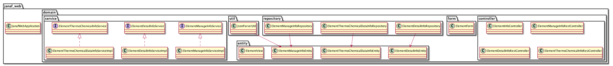

# Janaf-web

## Start janaf-web

```cmd
$ git clone https://github.com/y-ok/janaf-web.git
$ cd janaf-web
$ sh docker-start.sh product
```

## Access janaf-web
  http://192.168.99.100:8080/elements  

## Stopping janaf-web

```cmd
$ sh docker-stop.sh
```

## Remove docker-image, docker-process

```cmd
$ sh docker-remove-all.sh
```

## Janaf-web UML class diagram



## PLAN

 No.は優先順位を示す。なお、適宜計画内容の見直しを実施し、計画内容の削除・追加、優先順位の見直しを実施する。

 |No.| 計画内容 |見積期間 | 実績期間 |
 | --- | ------------------------------------------------------------------------- | ---------------------- | ------ |
 |1. | 元素を選択し、各温度における物理量を選択できるようにするフォーム画面を作成する。 | 2017.5M |
 |2. | 1.のフォーム画面から作成した情報をExcel、pdfで出力する機能を具備する。| 2017.5M 〜 2017.6B |
 |3. | 2.で作成したExcel、pdfの情報をjson形式で作成日毎にデータベースに保持する。| 2017.6B 〜 2017.6M |
 |4. | 温度の補完をし、補完した温度に従った物理量を推定し、データベースに保持する。もちろん、推定した物理量は1で選択できること。| 2017.6M 〜 2017.7B |
 |5. | ログイン機能を具備する。 | 2017.7B 〜 2017.7E |
 |6. | [janaf-chemicaldata-crawler](https://github.com/y-ok/janaf-chemicaldata-crawler)のスクレイピング機能を具備し、最新のデータを取り込めるようにする。| 2017.7E 〜 2017.8B |
 |7. | 当該webサービスはIPアドレスではなくホスト名で指定できるようにする。| 2017.8B 〜 2017.8M |
 |8. | ソフトウェアデザインパターンの観点で当該ソフトウェアの構造を見直す。| 2017.8M 〜 2017.9B |
 |9. | リファクタリングを実施する。| 2017.9B 〜 2017.9E |
 |10.| クラス図、コンポーネント図、シーケンス図を作成する。| 2017.10B 〜 2017.10M |
 |11.| 当該ソフトウェアの作成を通して得た技術をwikiに纏める。| 2017.10M 〜 2017.11M |
 |12.| JavaDocコメントを作成する。 | 2017.11M 〜 2017.11E |
 |13.| テストコードを作成する。| 2017.11E 〜 2017.12M |
 |14.| Jenkins CI環境を作成し、CIを回す。 | 2017.12M 〜 2017.12E |